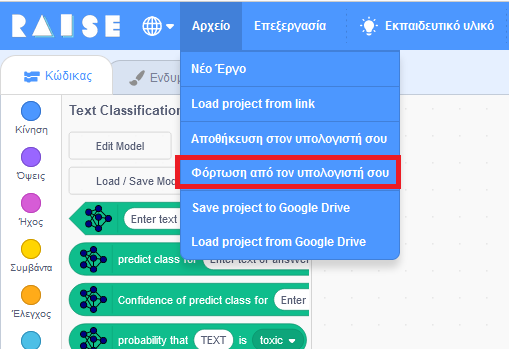
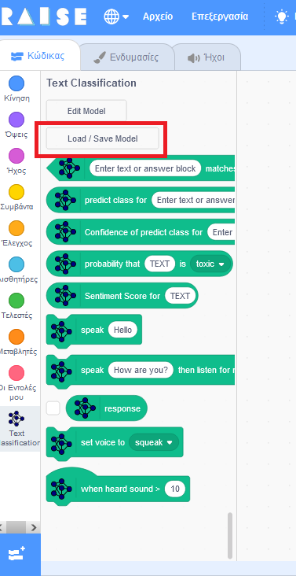
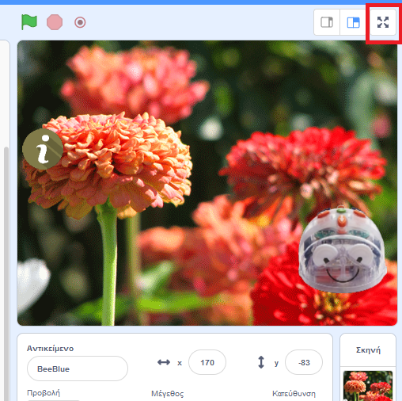
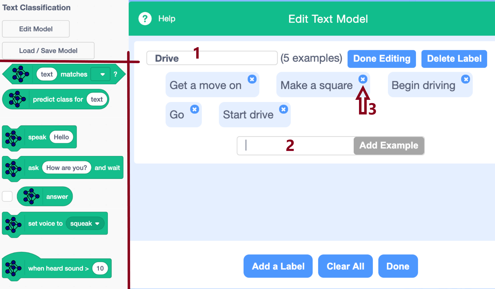
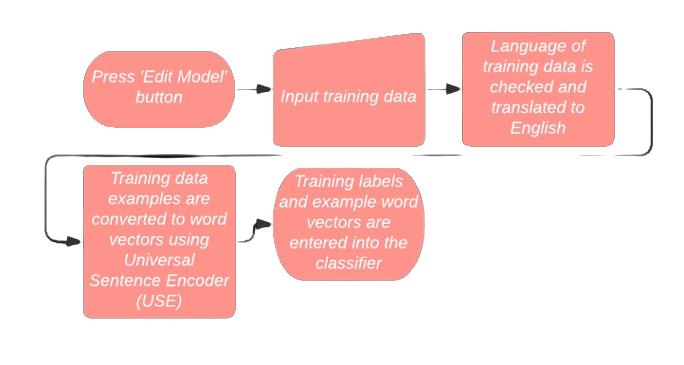
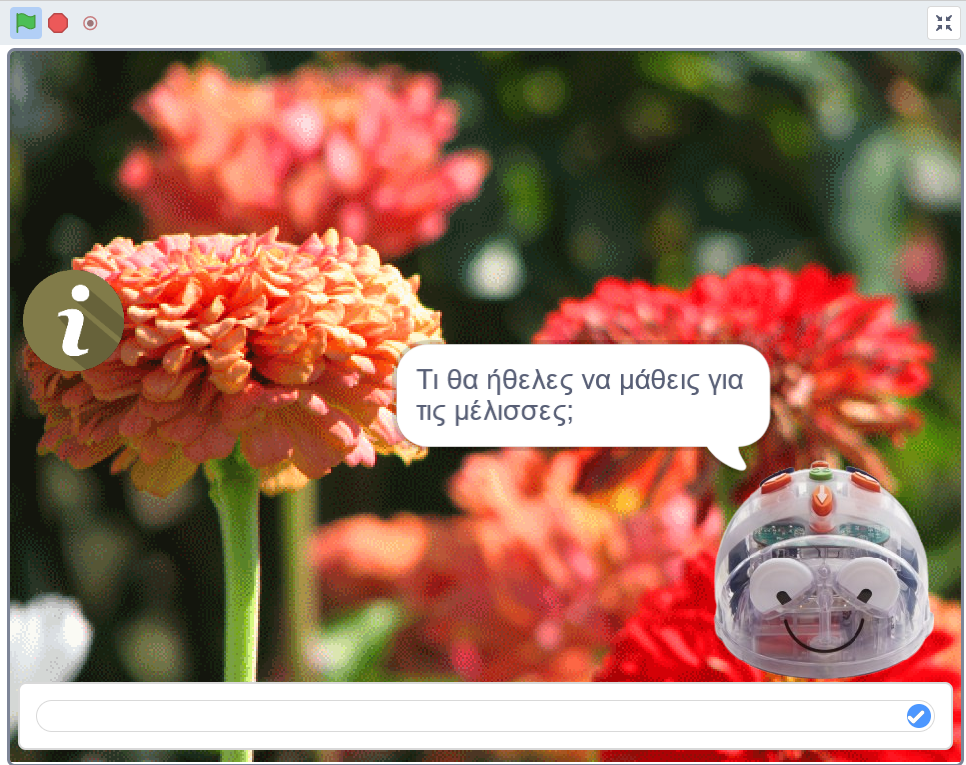
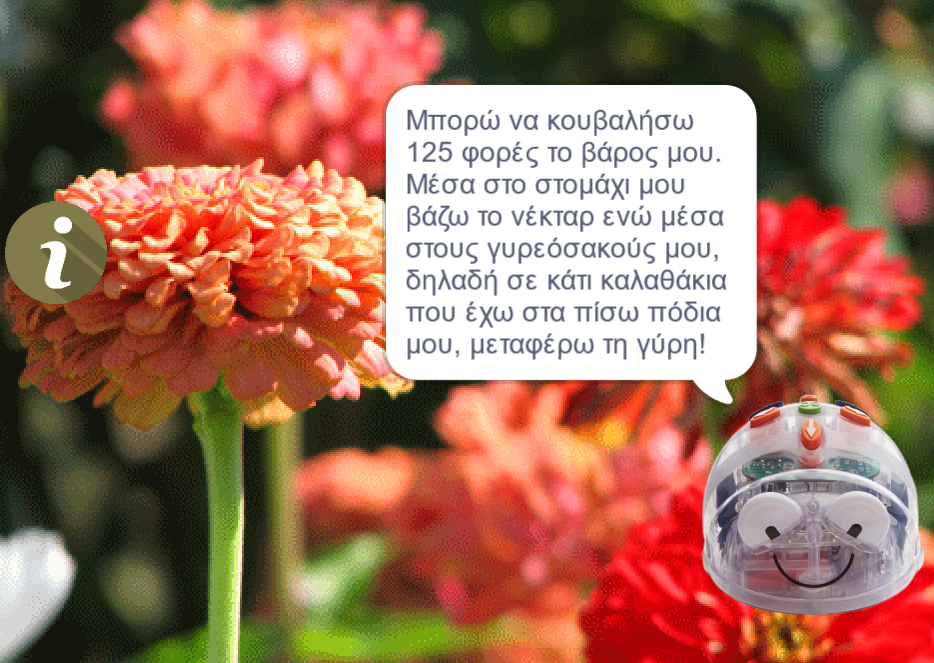
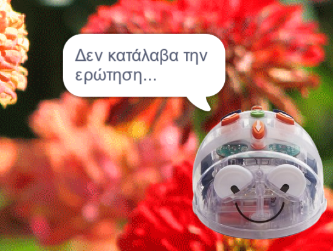
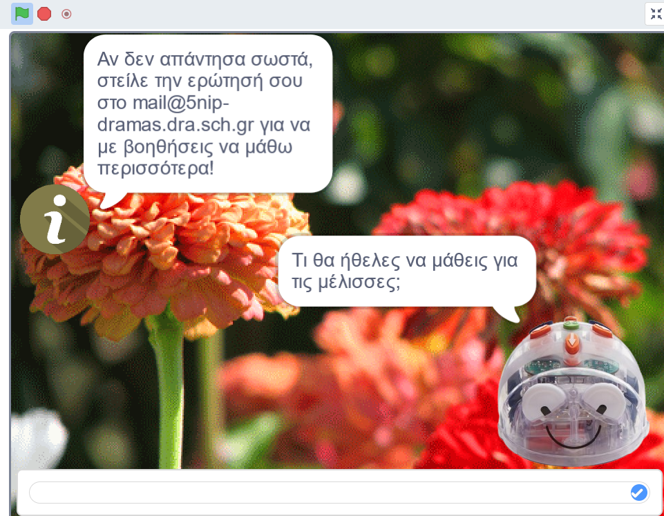

# BlueBee-Chat-Bot

## Περιγραφή

Το **BlueBee-Chat-Bot** είναι μια εφαρμογή συνομιλίας με τη **Blue-bot** με σκοπό την επίδειξη της διαδικασίας (επιβλεπόμενης) μηχανικής μάθησης 
με όσο το δυνατόν πιο απλό και κατανοητό τρόπο για τα παιδιά. Στόχος είναι να γίνει σαφής η διάκριση μεταξύ **ρητού προγραμματισμού** και **(επιβλεπόμενης) 
μάθησης μέσω παραδειγμάτων**. Μια διάκριση βέβαια που γίνεται αμέσως ορατή με απλή σύγκριση του μεγέθους του κώδικα του **BlueBee-Chat-Bot** σε σχέση με αυτόν του [Παιχνιδιού Bee-bot](https://github.com/5thkindergartenDrama/To-be-a-Bee-just-a-bit/blob/main/%CE%A0%CE%B1%CE%B9%CF%87%CE%BD%CE%AF%CE%B4%CE%B9%20Bee-bot/README.md). 
Εντούτοις, παρά τη διάκριση, συζητήθηκε με τα παιδιά και η αναλογία που ισχύει μεταξύ των δύο και συνοψίζεται στην ακόλουθη πρόταση:

>όπως για τους ηλεκτρονικούς υπολογιστές (ή τα robot), ισχύει ότι κάνουν ό,τι ακριβώς τους(τα) έχουμε **προγραμματίσει ρητά** να κάνουν, 
>έτσι και στην ειδικότερη περίπτωση της Μηχανικής Μάθησης μέσω παραδειγμάτων, οι υπολογιστές και τα robot **μαθαίνουν ό,τι τους έχουμε δώσει να μάθουν, 
> μέσω των παραδειγμάτων** εισόδου."

Στη συνέχεια, αφού καθορίστηκε ότι ο **στόχος** μας είναι **να βοηθήσουμε τη Bee-bot να μάθει να απαντάει σωστά στις ερωτήσεις που θα της θέτουμε**, αναλύθηκαν απλά και κατανοητά τα 3 βήματα/φάσεις της επιβλεπόμενης μηχανικής μάθησης, ήτοι: 

1. η **συλλογή παραδειγμάτων και κατηγορποίηση σε κλάσεις** (**ανάθεση ετικέτας**) αυτών (σε αυτά),
2. η **εκπαίδευση** με σκοπό την εκμάθηση μέσω των παραδειγμάτων και την παραγωγή του εκπαιδευμένου μοντέλου
3. **έλεγχος** μέσω της χρήσης του bot και **ανατροφοδότηση**,

με τα βήματα 1 και 2 να γίνονται "εκτός σύνδεσης" (offline) ή στο παρασκήνιο από τους ειδικούς (που στην προκειμένη περίπτωση ήταν η Ομάδα Έργου ("oι "Μεγάλοι" των Μελένιων")) και το 3ο από το κοινό μέσω της εφαρμογής συνομιλίας. 

Έγινε έτσι σαφές ότι η επιβλεπόμενη μηχανική μάθηση είναι μια χρονοβόρα και απαιτητική διαδικασία που απαιτεί **συνεχή ανατροφοδότηση** από τα παιδιά, με την έννοια ότι αν κρίνουν πως η απάτνηση στην ερώτηση που θα της κάνουν (αφού εκπαιδευθεί σε κάποιες αρχικές ερωτήσεις), δεν είναι αυτή που περίμεναν, θα πρέπει να προστεθεί αυτό το παράδειγμα/ερώτηση στη συλλογή εκπαίδευσης του bot, να ξαναγίνει εκπαίδευση στη νέα συλλογή και να επανελεγχθεί το bot για το επίπεδο μάθησης στο οποίο έχει φτάσει, με πιθανή εκ νέου ανατροφοδότηση και επανάληψη των Βημάτων 1 έως 3. 

Για το πρώτο βήμα, ζητήθηκε από τα παιδιά να μας πουν, αν είχαν τη δυνατότητα να ρωτήσουν τη μέλισσα, ποια θα ήταν η ερώτηση που θα της έκαναν. Οι ερωτήσεις τους, αλλά και οι απαντήσεις που δόθηκαν από τον μελισσοκόμο μας, καθώς και η ετικέτα που δόθηκε από την Oμάδα Έργου σε κάθε ερώτηση είναι οι εξής:

| Ετικέτα| Ερώτηση | Μελισσοκόμος |
|---|---|---|
|howold|Πόσα χρόνια ζείτε;| Οι μέλισσες ζούμε 40 μέρες την άνοιξη και το καλοκαίρι και μέχρι 3 μήνες τον χειμώνα. Η Βασίλισσά μας ζει 2 με 4 χρόνια! |
|honeyquant| Πόσο μέλι μπορεί να κάνει μια μέλισσα; | Για μια κουταλιά μέλι θα πρέπει να δουλέψουμε 4 με 7 μέλισσες όλη μέρα! |
|flyattrs| Μέχρι ποιο ύψος φτάνεις να πετάς;|Μπορώ και πετάω πολύ ψηλά και πάρα πολύ γρήγορα. Πιο γρήγορα από κάθε έντομο! |
|angry| Γιατί νευριάζεις όταν βλέπεις μαύρο χρώμα; |Οι περισσότεροι εχθροί μου έχουν μαύρο ή σκούρο χρώμα και αυτό με κάνει να νιώθω ότι απειλούν να καταστρέψουν την κυψέλη μας!|
|hivemaking| Πώς φτιάχνεις την κυψέλη; | Την κυψέλη, τη φτιάχνει ο  άνθρωπος για εμάς. Οι εργάτριες φτιάχνουν την κερήθρα που αποτελείται από χιλιάδες κελιά για να βάζουμε μέσα το μέλι ή τη γύρη ή τα αυγά και το φτιάχνουν από κερί. Το κερί το φτιάχνουνε οι εργάτριες με τους κηρογόνους αδένες τους! |
|navigation|Πώς βρίσκεις τον δρόμο για να γυρίσεις στην  φωλιά σου; | Βάζω σημάδια και χρησιμοποιώ τον ήλιο για να προσανατολιστώ!|
|carryattrs| Πόσο νέκταρ μπορείς να κουβαλήσεις;| Μπορώ να κουβαλήσω 125 φορές το βάρος μου. Μέσα στο στομάχι μου βάζω το νέκταρ ενώ μέσα στους γυρεόσακούς μου, δηλαδή σε κάτι καλαθάκια που έχω στα πίσω πόδια μου, μεταφέρω τη γύρη! |
|population| Πόσες μέλισσες χωράνε στην κυψέλη; | Μέχρι 60 χιλιάδες μέλισσες! | 
|honeyprod|Πώς το κάνετε το μέλι; | Η συλλέκτρια μέλισσα μεταφέρει το νέκταρ από τα λουλούδια μέσα στο στομάχι της. Μετά, το δίνει στις εργάτριες της κυψέλης οι οποίες το ανακατεύουν με το σάλιο τους και το αποθηκεύουν στο δικό τους στομάχι για λίγο διάστημα και μετά το φτύνουν στα κελιά της κερήθρας! |
|sphinx|Αν πολεμήσει μέλισσα με σφίγγα ποια νικάει; |  Οι  μέλισσες  ζούμε  σε ομάδες και ξέρουμε να συνεργαζόμαστε. Έτσι αν χρειαστεί να πολεμήσουμε με σφίγγα θα το κάνουμε σαν μια ομάδα  και γι αυτό καταφέρνουμε  να τις νικήσουμε.|

Στη συνέχεια, οι εκπαιδευτικοί της Ομάδας Έργου, προχώρησαν στη σύνταξη παραλλαγών της κάθε κατηγορίας/ερώτησης και προχωρήσαμε στην υλοποίηση του bot. Λογω των προβλημάτων στην υλοποίηση που αναφέρονται [παρακάτω](#προβλήματα-υλοποίησης), δεν έγινε δυνατό να δούμε μαζί με τα παιδιά την εφαρμογή συνομιλίας και να επιδείξουμε το 3ο βήμα της χρήσης του chatbot και της ανατροφοδότησής του. Παρόλα αυτά, τα παιδιά ενημερώθηκαν ότι θα προχωρήσουμε στην υλοποίηση και θα ειδοποιηθούν όταν αυτή ολοκληρωθεί, ώστε να μπορέσουν, με τη βοήθεια των οικείων τους, να συνομιλήσουν με τη Blue-Bot, να της κάνουν ερωτήσεις και να τη βοηθήσουν να μάθει καλύτερα και περισσότερα.

## Οδηγός Εκτέλεσης

Για να δοκιμάσετε την εφαρμογή:
1. Πλοηγηθείτε στην [διεύθυνση της προσωρινής εγκατάστασης του web προγράμματος Scratch 3](https://5thkindergartenofdrama.github.io/textClassification/).
2. Κατεβάστε το αρχείο με το πρόγραμμα Scratch [BlueBee-Chat-Bot.sb3](./BlueBee-Chat-Bot.sb3).
3. Φορτώστε το αρχείο που μόλις κατεβάσατε, στο web πρόγραμμα του Scratch:
   ||
   |---|
   |Επιλέξτε από το βασικό μενού "Αρχείο"->"Φόρτωση από τον υπολογιστή σου" και ανεβάστε το αρχείο sb3, από τον φάκελο που το κατεβάσατε στον υπολογιστή σας.|
   
   H επέκταση "TextClassification", προστίθεται αυτόματα στην περιοχή των εντολών block.
5. Κατεβάστε στον υπολογιστή σας το αρχείο των δεδομένων εκπαίδευσης [bee-questions-eng.json](./bee-questions-eng.json).
6. Φορτώστε το αρχείο που μόλις κατεβάσατε σύμφωνα με τις παρακάτω οδηγίες:
   |||
   |---|---|
   |α) Πατήστε "Load/Save Model"|β) Πατήστε "Περιήγηση..." και επιλέξτε το αρχείο από τον φάκελο στον οποίο το κατεβάσατε. γ) Πατήστε "Import Classifier" και περιμένετε το μήνυμα του "Text Classifier" "The model is ready", το οποίο εμφανίζεται με πράσινο χρώμα χαρακτήρων, στην περιοχή εντολών της επέκτασης, αφού τελειώσει η εκπαίδευση του μοντέλου.|
9. Στη συνέχεια, πατήστε το εικονίδιο εκτέλεσης σε πλήρη οθόνη 
   | |
   |---|
   
   και μετά το πράσινο σημαιάκι για να ξεκινήσει η εκτέλεση.

Για να δείτε τις οδηγίες χρήσης του chatbot, μεταβείτε στην ενότητα [Εφαρμογή συνομιλίας BlueBee-Chat-Bot](#εφαρμογή-συνομιλίας-bluebee-chat-bot).   

## Υλοποίηση

Το BlueBee-Chat-Bot δέχεται ερωτήσεις των παιδιών σχετικά με διαφορές θεματικές που αφορούν στις μέλισσες και απαντάει με βάση τα όσα γνωρίζει, εφόσον όμως αναγνωρίσει σωστά την ερώτηση. Επομένως, στην προκειμένη περίπτωση, το bot μαθαίνει να αναγνωρίζει ερωτήσεις χρησιμοποιώντας τεχνικές ταξινόμησης κειμένου (text classification). Ο γενικότερος κανόνας είναι ότι για να μάθουν σωστά τα bot θα πρέπει να δώσουμε όσο το δυνατόν περισσότερα και σωστά παραδείγματα, που στην προκειμένη περίπτωση είναι παραλλαγές της ίδιας ερώτησης.

Αν και έχει επικρατήσει ως κοινή πρακτική η υλοποίηση εφαρμογών Μηχανικής Μάθησης για παιδιά να βασίζεται κυρίως στην πλατφόρμα ["Μηχανική μάθηση για παιδιά"](https://machinelearningforkids.co.uk/#!/about), αποφασίστηκε από την Ομάδα του Έργου να χρησιμοποιηθεί η πλατφόρμα Scratch 3 [Raise AI Playground](https://playground.raise.mit.edu) (η οποία δημιουργήθηκε από κοινού από την πρωτοβουλία ["Responsible AI for Social Empowerment and Education" (RAISE)](https://raise.mit.edu/) και το [Personal Robots Group](https://robots.media.mit.edu) του [MIT Media Lab](https://www.media.mit.edu)) και η επέκτασή της ["Text Classification"](https://robots.media.mit.edu/wp-content/uploads/sites/7/2021/01/Text_classifier.pdf) για ταξινόμηση κειμένου, διότι:

- τα μοντέλα εκπαιδεύονται στην πλατφόρμα προγραμματισμού, με κλήσεις στις ηλ. υπηρεσίες της πλατφόρμας της κοινότητας Τεχνητής Νοημοσύνης και Μηχανικής Μάθησης [Κaggle](https://www.kaggle.com/), χωρίς -χρονικούς και άλλους- περιορισμούς και
- η μετάφραση των ερωτήσεων (παραδειγμάτων και ελέγχου)  από το Ελληνικά στα Αγγλικά, γίνεται αυτόματα από τη διαδικτυακή υπηρεσία μετάφρασης του Scratch, [translate](https://translate-service.scratch.mit.edu/translate) που διατηρείται στις υποδομές του ΜΙΤ, αίροντας και τους περιορισμούς (μητρικής) γλώσσας που εισάγουν άλλες πλατφόρμες εκπαίδευσης.

Παρόλα αυτά, όπως διαπιστώθηκε κατά τον έλεγχο της εκπαίδευσης, **φαίνεται να ισχύει ο περιορισμός μάθησης μέχρι 9 κατηγοριών/κλάσεων**, κάτι που αποτελεί αντικείμενο διερεύνησης σε επίπεδο κώδικα για να διαπιστωθεί κατά πόσο αποτελεί ένα από τα "προβλήματα" υλοποίησης της επέκτασης ή τίθεται ως περιορισμός από τη σχεδίασή της. Επιπλέον, διαπιστώθηκαν και άλλα προβλήματα, τα οποία οφείλονταν σε σφάλματα υλοποίησης της κλήσης προς την υπηρεσία αυτόματης μετάφρασης. Περισσότερα για τα σφάλματα υλοποίησης και τον τρόπο που αντιμετωπίστηκαν, μπορείτε να δείτε [παρακάτω](#προβλήματα-υλοποίησης). 

### Εισαγωγή δεδομένων εκπαίδευσης και εκπαιδευμένο μοντέλο μάθησης

Η εισαγωγή των δεδομένων εκπαίδευσης (παραδειγμάτων και κατηγορίας/κλάσης τους) γίνεται με την εύχρηστη γραφική διεπαφή χρήστη που έχει δημιουργηθεί από τους προγραμματιστές της επέκτασης. 

|  |
|---|
| *Η διεπαφή χρήστη για την εισαγωγή δεδομένων εκπαίδευσης: Η εισαγωγή ξεκινάει πατώντας "Edit Model". Δίνεται η δυνατότητα: a) επεξεργασίας του ονόματος της κλάσης μέσω του textbox 1, b) προσθήκης παραδειγμάτων της κλάσης μέσω του textbox 2 και πατώντας "Add Example" μετά, γ) διαγραφής παραδείγματος πατώντας το αντίστοιχο "x" (3 στο στιγμιότυπο). Μετά την εισαγωγή των δεδομένων της κλάσης ο χρήστης πατάει "Done Editing", ενώ ανά πάσα στιγμή μπορεί να πατήσει "Delete Label" για τη διαγραφή συνολικά της ετικέτας/κλάσης μαζί με τα παραδείγματά της. Η εισαγωγή νέας ετικέτας παραδειγμάτων, γίνεται πατώντας "Add a Label" και η διαδικασία εισαγωγής συνολικά τελειώνει πατώντας "Done", ενώ πατώντας "Clear All" διαγράφονται όλα τα δεδομένα εκπαίδευσης.* |
|**Πηγή:** https://robots.media.mit.edu/wp-content/uploads/sites/7/2021/03/06_text_class.pdf| 

Όταν η εισαγωγή τελειώσει, γίνεται η αυτόματη μετάφραση των ερωτήσεων από τα Ελληνικά στα Αγγλικά και ακολουθεί η δημιουργία του (εκπαιδευμένου) μοντέλου. Η αρχική αυτή διαδικασία περιγράφεται γραφικά παρακάτω:

|  |
|:--:|
| Η αρχική διαδικασία εισαγωγής δεδομένων και εκπαίδευσης. |
| **Πηγή:** https://robots.media.mit.edu/wp-content/uploads/sites/7/2021/03/06_text_class.pdf|

Μετά την εκπαίδευση το bot είναι έτοιμο για χρήση δηλ. υποβολή ερωτήσεων για να ελεγχθεί η απόκρισή του. Η διεπαφή επιτρέπει: 
- τη δυναμική αλλαγή ανά πάσα στιγμή των δεδομένων εκπαίδευσης, προσθέτοντας, αφαιρώντας ή αλλάζοντας τις διάφορες ετικέτες και τα αντίστοιχα παραδείγματά τους,
- την αποθήκευση των δεδομένων εκπαίδευσης σε μορφή json και με κατάλληλη δομή περιγραφής τους και
- τη φόρτωση των δεδομένων εκπαίδευσης από αρχείο json.

### Εφαρμογή συνομιλίας BlueBee-Chat-Bot

Η εφαρμογή υλοποιήθηκε σε  Scratch 3 και δίνει τη δυνατότητα 
1. Εισαγωγής ερώτησης μέσω του textbox εισόδου
2. Χρήσης, ελέγχου και ανατροφοδότησης όπως φαίνεται στα παρακάτω στιγμιότυπα.

| |
|--|
|Προτροπή (prompt) για εισαγωγή ερωτήματος|

|| 
|---|--|
 |Απάντηση στην ερώτηση: "Πόση γύρη μπορείς να συλλέξεις;" | Απάντηση στην "άγνωστη" ερώτηση "Αν πολεμήσει μέλισσα με σφίγγα ποιος νικάει;", της 10ης κατηγορίας/κλάσης, τα παραδείγματα της οποίας αν και δόθηκαν στη διαδικασία εκπαίδευσης, δε λήφθηκαν υπόψη!|

| |
|--|
|Το μήνυμα ανατροφοδότησης με τη μορφή e-mail που μπορεί να στείλει το παιδί, με την βοήθεια των οικείων του, στο mail@5nip-dramas.dra.sch.gr του 5ου Νηπιαγωγείου Δράμας. Εμφανίζεται κάνοντας κλικ πάνω στο εικονίδιο ***i***.|

## Προβλήματα Υλοποίησης

Τα 2 προβλήματα στην υλοποίηση της επέκτασης "TextClassification" που διαπιστώθηκαν κατά την εκτέλεση, ήταν:
1. Σφάλματα στην υλοποίηση της κλήσης της ηλεκτρονικής υπηρεσίας [translate]() του Scratch, που επηρεάζουν
   - τόσο τo offline στάδιο της εκπαίδευσης,
   - όσο και την εφαρμογή chatbot,

   αφού σε αυτά τα 2 σημεία  απαιτείται η μετάφραση των ερωτημάτων από τα Ελληνικά στα Αγγλικά και
2. Το όριο των 9 κλάσεων που φαίνεται να υπάρχει στον ταξινομητή κειμένου, με αποτέλεσμα να αγνοούνται οι κλάσεις από την 10η και πάνω κατά τον έλεγχο της μάθησης του bot και να μην αναγνωρίζονται τα παραδειγματά τους.

Αποφασίστηκε, για την ώρα: 
- να διορθωθούν  τα σφάλματα μετάφρασης στην περίπτωση της online εφαρμογής χρήσης και ελέγχου του bot,
ενώ 
- η μετάφραση των παραδειγμάτων των δεδομένων εκπαίδευσης να γίνει από την Ομάδα Έργου, αφού πρόκειται για μια offline διαδικασία και
- τόσο τα σφάλματα μετάφρασης σε αυτή τη διαδικασία όσο και το όριο των 9 κλάσεων να εξεταστούν αργότερα.
 
Για τη διερεύνηση και την αντιμετώπιση, αυτών των προβλημάτων:
1. Ο κώδικας του [αποθετηρίου (repository) ανάπτυξης επεκτάσεων Scratch του playground της RAISE στο github](https://github.com/mitmedialab/prg-extension-boilerplate), αντιγράφηκε με τη λειτουργία fork σε repository του [Οργανισμού github του 5ου Νηπιαγωγείου Δράμας](https://github.com/5thKindergartenOfDrama/).
2. Διορθώθηκε το πρόβλημα των λαθών στην κλήση της υπηρεσίας κατά το στάδιο του ελέγχου/χρήσης του chatbot και
3. Διατέθηκε προς χρήση (deployed) αντίγραφο συνολικά του RAISE playground με τη διορθωμένη -και όλες τις υπόλοιπες επεκτάσεις του- στην προσωρινή διεύθυνση https://5thkindergartenofdrama.github.io/textClassification/ υπό την [άδεια χρήσης που ορίζει το RAISE Playground](https://playground.raise.mit.edu/Landing%20Page/About.html).

Πρόθεσή μας είναι να ακολουθήσουμε την προτροπή των μελών της κοινότητας ανάπτυξης του RAISE Playground 

>"However, if you want to share your extension externally, especially with students, it must first be integrated into the main branch, and then > you can direct them to: https://playground.raise.mit.edu/main/"
>
και 
- όταν όλα τα λάθη διορθωθούν σταδιακά,
- οι διορθώσεις γίνουν αποδεκτές από την κοινότητα και
- προστεθούν στην "επίσημη" επέκταση "TextClassification" του playground στη διεύθυνση https://playground.raise.mit.edu/main/,

οι ενδιαφερόμενοι να παραπέμπονται σε αυτή τη διεύθυνση εκτέλεσης του chatbot, αντί της προσωρινής https://5thkindergartenofdrama.github.io/textClassification/ στην οποία παραπέμπονται για την ώρα!

## Οι "Μεγάλοι" των Μελένιων (Ομάδα Έργου)
- ***Μαρία Παπαδοπούλου***, **Εκπαιδευτικός ΠΕ60**, Προϊσταμένη 5ου Νηπιαγωγείου Δράμας, mariapap14771@gmail.com
- ***Σταυρούλα Αυγητίδου***, **Εκπαιδευτικός ΠΕ60.5**, 5ο Νηπιαγωγείο Δράμας, roulavgi@gmail.com
- ***Αρχιμήδης Καραγιαννίδης***, **Εκπαιδευτικός ΠΕ70**, Δημοτικό Σχολείο Ανδριανής Νικηφόρου, **Μελισσοκόμος**, archimedeska@gmail.com, archimedes@sch.gr
- ***Ηλίας Γκρίνιας***, **ΠΕ Πληροφορικής (Software-Hardware)**, Τμήμα Ψηφιακών Υπηρεσιών & Διαφάνειας, Δ/νση Ανάπτυξης, Προγραμματισμού & Ψηφιακών Υπηρεσιών, Δήμος Καβάλας, elgrinias@gmail.com, hgrinias@kavala.gov.gr

## Αναγνώριση

Η ανάπτυξη του **BlueBee-Chat-Bot** έγινε στις εγκαταστάσεις των [**Crea Centers Kavala**](https://www.facebook.com/p/Crea-Centers-Kavala-100083365117774), στους χώρους εργασίας του νέου "Ατελιέ Πολυμέσων" της δομής.

## Ευχαριστίες
Ευχαριστούμε θερμά:

- την [***Ιώ Χατζηβαρύτη***](https://www.linkedin.com/in/io-chatzivaryti-34528427/), **Ειδική Σύμβουλο Ευρωπαϊκών Προγραμμάτων του Δημάρχου Καβάλας**, Υπεύθυνη Υλοποίησης του έργου [BSB757- CREA CENTERS](https://creacenters.eu/) για την Καβάλα, καθώς και Υπεύθυνη Προγράμματος της δομής **Crea Centers Kavala**, για την παραχώρηση του "Ατελιέ Πολυμέσων" της δομής και
- Τη Δ/νση Ανάπτυξης, Προγραμματισμού & Ψηφιακών Υπηρεσιών του [Δήμου Καβάλας](https://kavala.gov.gr) για την ενθάρρυνση/στήριξη της όλης προσπάθειας. 

